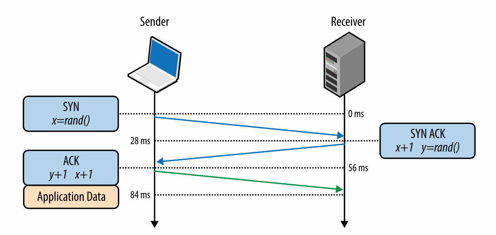
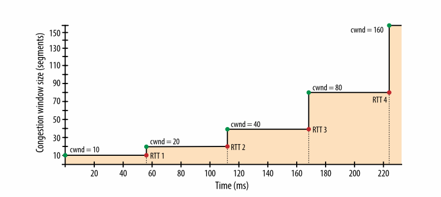

互联网中两个关键的协议是 IP 和 TCP。IP 协议用来主机间的路由和寻址。TCP 协议提供了在不可靠信道上的可靠网络抽象。 TCP/IP 首先由 Vint Cerf 和 Bob Kahn 在 1974 年发表的名为《一个用于分组网络互通的协议》中提出，用来指代互联网协议栈。

原始的提案（RFC 675）被重新修了了多次。1981 年提出的第四版 TCP/IP 规范由两个 RFC 组成，分别是
1. RFC 791 - IP
2. RFC 793 - TCP

从那之后，提出了一系列针对 TCP 协议的改进方案，但是核心的操作没有明显的改变。TCP 快速取代了之前的协议，现在是许多流行应用的选择，如 万维网、电子邮件、文件传输等待。

TCP 提供了一个在不可靠信道上建立可靠网络的有效抽象，隐藏了大多数网络交流中复杂的细节，比如说数据丢失，顺序传输，控制和避免拥塞，数据完整性等待。当使用 TCP 数据流工作保证了接收方可以分辨出发送方的每一个字节，并且按照顺序接受。TCP 是针对精确传输进行优化，而不是传输的时间，这就为网络性能的优化带来了挑战。

HTTP 标准并不强制使用 TCP 作为唯一的传输协议。如果我们想要的话，我们可以通过套接字（UDP）来传输 HTTP，或者其他的传输层协议。但是实际中，由于许多开箱即用的方便特性，互联网中所有的 HTTP 流量都是通过 TCP 完成的。

正因为如此，为了提供一个高性能的网络体验，理解一些 TCP 的核心机制是非常有必要的。亦可能不会有在应用中直接使用 TCP 套接字的机会，但是你构建应用层协议的设计性能会取决于 TCP 和底层网络的表现。

> **TCP 和 IP 协议纠缠在一起的历史**
>
> 我们对 IPv4 和 IPv6 都很了解，那么 IPv{1,2,3,5} 发生了什么？IPv4 中的 4 代表了在 1981 年 9 月发布的 TCP/IP 协议的第四版。原始的 TCP/IP 提案包莲莲两个协议，第四版草案官方地分成了两个 RFC。因此 IPv4 中的 v4 是历史遗留问题，并没有独立的 IPv1，IPv2 和 IPv3 协议。
>
> 当工作小组在 1994 年着手于“下一代互联网协议”时需要一个新的数字，但是 v5 已经在另外一个实验性的协议（互联网流式协议 ST）中使用了，ST 从来没有流行过，所以大家也几乎没有听到过。所以下一代互联网协议称为 IPv6。

# 三次握手
所有的 TCP 连接均由三次握手开始，如图 2-1 所示。

图 2-1 三次握手

在客户端或者服务器端可以交换应用层的数据之前，连接的两端必须在数据包的序列号上达成一致，同时这个序列号座椅连接的一个参数。由于安全因素，这个序列号是随机采用的。

*SYN*
客户端算则一个随机的序列数 x 并且发送一个包含其他额外 TCP 标志和选项的 SYN 包

*SYN ACK*
服务器端将 x 加一，自己选择一个随机的序列数 y，加上一些自己的标志和选项，发送应答

*ACK*
客户端将 x 和 y 均加一，通过发送 ACK 包完成握手。

一旦完成了三次握手，应用层的数据开始在客户端和服务器端传输。客户端可以在 ACK 包之后直接发送数据包，服务器端必须等到 ACK 之后才可以发送数据。这个初始化过程发生在每一个 TCP 连接，并且暗示了每一个使用 TCP 协议的性能：每一个新的连接在发送应用层数据前都会有一个往返的延迟。

举例来说，如果我们的客户端在纽约，服务器端在伦敦，我们通过光纤建立一个新的 TCP 连接，那么三次握手至少占用 56 ms，表 1-1 中展示了一个方向的传播延迟是 28 ms，之后它还要返回纽约。注意，带宽在连接中没有起到作用。实际上，延迟是由客户端和服务端之间信号传播的延迟造成，也就是从纽约到伦敦的传播时间。

由于无法避免由三次握手造成的延迟，建立新的 TCP 连接是很昂贵的，所以连接重用是运行在 TCP 上应用的重要优化方式。

> **TCP 快速连接**
>
> 加载一个网页通常需要从十几个不同的主机获取几百个资源。换句话说，这需要浏览器建立十几个新的 TCP 连接，每一个都会因为 TCP 握手带来额外的开心。这显著增加了网络浏览的延迟，尤其是在移动网络中。
>
> TCP 快速连接（TFO) 是一个用来通过在 SYN 包中传递数据从而降低建立 TCP 连接延迟的机制。 然而它有它自己的局限性， SYN 包的大小有限制，只有几种 HTTP 请求可以发送，由于需要加密 cookie，它只能在重复连接上使用。你可以在最新的 IEFT 草案中找到 TCP 快速连接
>
> 使用 TFO 需要服务器端，客户端以及应用的支持。最好的结果是在 linux 内核 v4.1 以上以及相应的客户端（比如 Linux, iOS9+/OSX 10.11+）并且在应用中开启了合适的套接字选项。 
>
> 基于谷歌完成的流量分析和网络模拟，研究人员展示出 TFO 可以降低 15% 的 HTTP 延迟，平均减少 10% 的页面打开时间，在高网络延迟的情况下可以降低 40%。

# 拥塞避免和控制
早在 1984 年，John Nagle 记录了被称作“拥塞崩溃”的情况。这种情况可能影响节点间带宽不对称的网络。

> John Nagle, RFC 896
>
> 在复杂网络中可以观察到拥塞控制的问题。我们已经发现了国防部的 IP 协议 - 纯的数据报协议，和 TCP 协议 - 传输层协议 一起使用的时候，传输层和数据报层的交流会造成一个不常见的拥塞问题。实际上，IP 网关很容易受到“拥塞崩溃”现象的应用，尤其是网关连接了两个带宽不一样的网络。
>
> 当主机的往返时间超过了最大传输间隔，主机会发送越来越多相同数据的拷贝到网络中去。最终，当交换节点上所有可用的缓存都被占满，数据包会被丢掉。数据包的往返时间达到最大值时，主机会多次发送相同的数据包，并且目的地也会收到每一个包的多个拷贝。这就是拥塞崩溃。
>
> 这种情况是稳定的。一但达到了网络的饱和点，如果数据包是随机丢弃的，网络会持续在这种糟糕的环境中运行。

这个报告指出了在 ARPANET 中，拥塞崩溃的现象不会发生，因为大多数的节点带宽相同，并且主干网络有潜在的额外容量。然而这些断言并没有很快就不再成立。在 1986 年，网络节点数量大量增加，一系列的拥塞崩溃问题横扫整个网络，一些情况下网络容量下降的千分之一，一些网络变得不可用。

为了解决这些问题，TCP 实现了多种机制来控制数据的发送速率：流量控制，拥塞控制和拥塞避免。

**note**
> 美国高级研究计划署(ARPANET) 是现代互联和的先驱，搭建了世界上第一个可操作的包交换网络。这个项目在 1969 年真是开展，在 1983 年 TCP/IP 作为主要的交流协议取代了更早的网络控制项目（NCP）。正如他们所说，其余的都变成了历史

# 流量控制
流量控制是用来阻止发送方发送接收方无法处理的数据的机制。接收方可能巨大负荷下，状态繁忙，或者是仅仅接受缓存大小决定的数据量。如图 2- 2 所示，为了解决这个问题，TCP 连接的两端都公布出它的接受窗口（rwnd），用来交流数据接收缓存的大小。

图 2-2 接受窗口（RWND）大小

当第一次建立连接的时候，两边都是用系统默认设定来初始化 rwnd 的值。一个典型的网络页面会将服务器的数据发送的客户端，这使得客户端的窗口可能会成为瓶颈。然而，如果客户端发送大量数据到服务器，那么服务器的窗口会成为主要的限制因素。

无论因为什么原因，当任何一段无法接受数据时，它会通知发送者一个更小的窗口。如果窗口大小达到 0，这会被认为是不要再发送任何数据知道应用层将缓存的数据处理完毕。这个工作流程在 TCP 协议的每一次连接中都会存在。ACK 包包含了每一端最新的 rwnd 值，允许两端根据网络容量和数据处理速度动态调整数据流的速率。

> **窗口缩放 RFC1323**
>
> 原始的 TCP 规范分配了 16 比特给接受窗口大小，这就限制接收方和发送方直接交流的上限（2^16 比特，或者说 65，535 字节）。为了优化性能，这个上限经常不够大，尤其是具有高带宽延迟乘积的网络中。更多的信息可以在 [带宽-延迟乘积](https://hpbn.co/building-blocks-of-tcp/#bandwidth-delay-product)中找到。
>
> 为了解决这个问题, RFC 1323 提出了 “TCP 窗口缩放” 选项，运行透明提升最大接受窗口大小从 65，535 字节到 1 GB。这个窗口缩放选项在三次握手中交换，带上了一个 16 bit 的左移大小，在之后的 ACK 中使用。
>
> 如今，主流的平台都默认启动 TCP 窗口缩放。然而，一些中间节点，路由器和防火墙可以重写甚至取消这一选项。如果你连接服务器或者客户端的时候不能充分利用带宽，检查窗口大小是一个好的开始。在 Linux 平台上，窗口缩放设置可以用一下命令开启
> 1. $> sysctl net.ipv4.tcp_window_scaling
> 2. $> sysctl -w net.ipv4.tcp_window_scaling=1

# 慢启动
尽管在 TCP 协议中有了流量控制，在 1980 年代中后期时拥塞崩溃依然是一个实际的问题。虽然流量控制防止了发送方发送过多的数据给接收方，但是仍然没有机制防止底层网络的崩溃。在连接建立的时候发送方和接收方都知道了可利用的带宽，但是仍然需要一个机制估计和适应底层网络的状况。

用一个例子来说明这样的适应是有益的，想象一下你在家中从远程服务器上下载一个很大的视频流，它可以通过占用整个下载线路来提供最高质量的用户体验，之后，家中的另一个用户建立了一个新的网络连接来下载一个网络更新。下载视频流的下行带宽数量突然减少，视频服务器必须调整它的传输速率，如果它继续按照之前的速率的话会导致网络使用效率下降，因为数据将会在堆积在中间网关，数据包会被丢掉。

在 1988 年，Van Jacobson 和 Michael J. Karels 记录了一系列算法来解决这一的问题，如慢启动，拥塞避免，快速重传和快速恢复。这四个算法都迅速的成为了 TCP 规范中必不可少的一部分。实际上，事实上，人们普遍认为因为 TCP 的这些更新避免了在上世纪80年代和90年代初流量指数增长情况下发生网络崩溃。

最好的理解慢启动的方法是了解它是怎么工作的。所有让我们回到位于纽约的客户端上，尝试从伦敦的服务器上检索一个文件。首先进行三次握手，这个过程中，如图 2-2 所示，通过 ACK 包，两端都宣告了各自的接受窗口(rwnd)大小。一旦最终的 ACK 包放入了网络中，我们可以开始交换应用数据。
估算客户端和服务器端可用容量的唯一方式是通过交换数据，这恰好是慢启动设计去做的事情。为了开始传输数据，服务器为每一个 TCP 连接初始化了一个新的拥塞窗口(cwnd)，并将初始值设置成一个保守的，针对系统的值(在 Linux 上是 initcwnd)。

*拥塞窗口大小(cwnd)* 发送方在没有收到客户端 ACK 之前处在传输状态的最大数据量。

cwnd 不会在发送方和接收方之间相互通知或交换，在这种情况下，它会是伦敦服务器私有并且维护。一个新的规则是在客户端和服务器之间处在传输状态的数据量最大是 rwnd 和 cwnd 之间的最小值。目前为止一切顺利，但是服务器和客户端如何确定它们拥塞窗口的值呢？毕竟网络状态在一直发生变化，正如我们之前的例子中的那样，两点间的情况都在不断改变。如果能有一个算法不需要为每一个连接手动调整窗口大小，那将会是很棒的。

解决方法是随着接受数据包的过程不断增大窗口大小，这就是慢启动。最开始的时候，cwnd 的初始值被设置成 1 个数据段。 在 1999 年 4月，RFC 2581 将这个值更新成 4 个数据段。2013 年 4 月，RFC 6928 中将这个值增加到了 10 个数据段。

客户端和服务器之间处在传输状态的数据量最大是 rwnd 和 cwnd 之间的最小值，因此一个现代的服务器可以发送 10 个数据段给客户端，之后它必须停止发送，等待客户端的回复。之后，每收到一个 ACK 包，慢启动算法将 cwnd 的大小增加一个数据段，因此，每收到一个数据包可以发出去两个新的数据包，这被称作指数增长算法，如图 2-3。客户端和服务器端尝试快速收敛到它们之间可用网络带宽。

图 2-3 拥塞控制和拥塞避免

那么我们在构建网络应用的时候为什么要考虑慢启动呢？HTTP 和很多应用协议都是建立在 TCP 之上的，无论可用带宽是多少，每一个 TCP 连接都要经过慢启动的阶段，这意味着我们不能在一开始就利用线路的整个容量。

相反，我们从一个很小的拥塞窗口开始，每一个数据来回使这个窗口大小加倍(指数增长)。结论是达到一个特定的吞吐量是一个关于初始拥塞窗口大小和客户端-服务器端之间往返时间的函数。

$$Time=RTT*\lceil log_2(\frac{N}{initial cwnd}) \rceil$$

用上述情景作为一个例子来描述慢启动的影响：
1. 客户端和服务器端的接受窗口大小： 65,535 字节（64 KB）
2. 初始拥塞窗口大小：10 数据段（RFC 6982）
3. 往返时间：56 ms (伦敦到纽约)

不需要考虑 64 KB 的接受窗口大小，新建立的 TCP 连接受限于拥塞窗口的大小。实际上，达到 64 KB 的接受窗口限制，我们需要先将滑动窗口大小增加到 45 个数据段，这会占用 大概 168 ms。

$$/frac{65,535 bytes}{1,460 bytes} \approx 45 segments$$
$$56 ms * \lceil log_2\frac{45}{10} = 168$$

如图 2-4 所示，达到 64 KB 的吞吐量需要客户端和服务器端之间三个来回！实际上由于慢启动的因素，客户端和服务器端之间可能存在的数 Mbps 的容量对一个新的连接建立没有任何用处。

图 2-4. 拥塞控制窗口大小的增长

**note**
> 上述例子使用了新的（RFC 6928）的值，10个数据段作为拥塞网络的初始值。如果你使用老一点的大小，4 个数据段，重复上述计算，你会发现增加了一个往返时间，56 ms。

