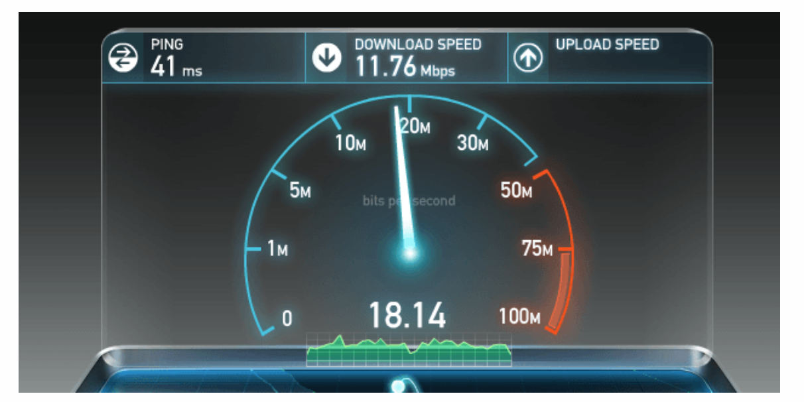

# 速度是特性

最近几年里，网络性能优化（WPO）的出现和快速增长，表现出用户对于响应快速的用户体验的需求。这不仅仅是简单是加速连接世界带来的 “我们需要速度” 的心理作用，而是由实际经验显示出的需求。这些经验来自于对许多在线业务的底线性能的衡量。

* 更快的网站带来更高的用户参与度
* 更快的网站带来更高的用户留存
* 更快的网站带来更高的用户转换率

简单来说，速度是一个特性。为了实现这一点，我们需要去理解许多关于性能的因素和底层限制。在这一章中，我们会关注与两个描述所有网络流量的关键因素：延迟和带宽。

_延迟_

从信息源发送数据包到目的地接收到该数据包所需要的时间

_带宽_

逻辑或物理通道的最大吞吐量

_图1-1 延迟和带宽_

为了更好的理解带宽和延迟是如何联系在一起的，在接下来有关 TCP， UDP 和所有应用层协议的章节中，我们会使用它们作为工具，深入挖掘其中的价值。

> **使用爱尔兰高速网络\(Hibernia Express\)降低跨洋延迟**
>
> 在金融领域中，对于高频交易算法来说延迟是一个重要的标准，几毫秒的变化会造成数百万的损失或者利润。
>
> 在 2015 年九月，爱尔兰网络下水了新的光纤网络\(Hibernia Express\)，这个网络设计用来确保纽约到伦敦的延迟最低。该项目的最低费用估计在三十亿美元之上，新的线路使得这两个城市之间的延迟达到了 58.95 ms，比所有现存的网络提升约 5 ms 左右，相当于每节约一毫秒需要花费至少 6 千万美元。
>
> 延迟是昂贵的 - 无论是字面上还是实际意义上

# 延迟的许多组成部分

延迟指的是消息或者数据包从源点到目的点的时间。这是一个简单又有用的定义，但是它隐藏了很多有用的信息。每一个系统都包含了很多的源或者组成部分，这些都在传递信息的过程中占用了一定的时间，理解哪些部分占用了时间对于描述系统性能是十分关键的。

让我们更仔细的了解一下在典型的互联网线路中常见的组成部分，了解它们在信息传递中的责任。

_传播延迟_

信息在发送者和接受者之间传播所需要的时间，这部分时间由距离和信号传递的速度决定。

_发送延迟_

将数据包中的所有比特放进线路中所需要的时间，这部分时间由数据包的长度和线路的数据速率决定。

_处理延迟_

处理数据包包头所需要的时间，用于检查比特级别的错误并且确定数据包的目的地。

_等待延迟_

数据包在队列中等待处理的时间。

客户端和服务器之间的总延迟由上述延迟组合而成。传播时间由距离和信号传播的介质觉得，正如我们看到的那样，传播速度通常是光速和一些其他很小的因素。另一方面，发送延迟由可用的传输线路的数据速率决定，和客户端到服务器的距离无关。举例来说，我们假设在 1 Mbps 和 100 Mbps 这两种线路中传送一个 10 Mb 的文件。在 1 Mbps 的线路中会花费 10 秒， 而在 100 Mbps 的线路中只需要 0.1 秒。

**注意**

> 网络的数据传输速率通常用每秒钟传输的比特数来计算的（bps），相反，在非网络相关的设备中数据传输速率通常使用字节每秒（Bps）来表示。注意单位上的差距，这通常会造成一些困惑。

接下来，一旦数据包到达路由器，路由器会通过检查包头来确定如何送到下一个路由器还可能做一些其他方面的检查，这些操作都会占用一定的时间。大多数这些操作逻辑是通过硬件完成的，使得占用的时间会很小，但是它们确实存在。最终，如果数据包到达的速率比路由器处理的速度还要快得话，这些数据包会在输入缓冲中等待。在输入缓冲中等待的时间被称作等待延迟。

> **本地路由器的缓存过满**
>
> 缓存过满（bufferbloat）是由 Jim Gettys 在 2010 年提出的一个术语，是一个等待延迟影响整个网络性能的很好的例子。  
> 在所有情况下数据包都不应该丢掉这一假设造成的潜在问题是很多的路由器都有很大的输入缓存。然而这导致了 TCP 的拥塞控制机制（我们在下一章介绍）并且会引入多变的等待延迟到网络中。  
> 好消息是用来解决这一问题的 CoDel 主动队列管理的新算法已经被提出，并且已经在 Linux 3.5 以上的内核中实现。你可以在 ["控制等待延迟"](https://hpbn.co/aqmacm) 了解到更多信息。

# 光速和传播延迟

正如爱因斯坦在相对论中提出的那样，攻速是所有物质，能量和信息所能达到的最高速度。这是一个数据包在网络传播中所需时间的明显的限制。

好消息是光速是很快的，能到达每秒 299，792，458米，或者 186，282 英里。然而，这是光速在真空中的速度。相反，我们的数据包需要在如铜线或者光纤这些的介质中传播，这会使信号传递的速度变慢，如表1-1中所示。数据包在真空中和在介质中传播的速度的比被称作介质的折射率。折射率越大，传播的速度越慢。

| 线路 | 距离 | 真空中的时间 | 光纤中的时间 | 光纤中来回所需的时间（RTT） |
| --- | --- | --- | --- | --- |
| 纽约到三番 | 4，148km | 14ms | 21ms | 42ms |
| 纽约到伦敦 | 5，585km | 19ms | 28ms | 56ms |
| 纽约到悉尼 | 15，993km | 53ms | 80ms | 160ms |
| 赤道周长 | 40,075ms | 133.7ms | 200ms | 200ms |

表 1-1 信号在真空中和在光纤中的延迟

我们长距离的传输数据包所使用的介质通常是光纤，它折射率在 1.4 到 1.6 之间不等，虽然有点低，但是我们再不断的提升介质的质量来降低折射率。简单来说，光在光纤中的速度大约是 200，000，000 米每秒，相应的折射率大约是 1.5。值得注意的是，我们已经相当接近能够实现的最大速度，这不能不称为是一个令人惊奇的成就。

虽然光的速度很快，但是从纽约到悉尼一个来回也需要大概 160 ms 左右。 表 1-1 中的数据依旧是在假设数据包在两者之间的有一个大圆弧连接（在球上两点的最短距离）的理想情况下的数据。实际上这几乎是不可能的，纽约和悉尼之间的数据包会通过比理想状态下远的多的距离。在这一线路中的每一跳都会带来额外的路由，传输，等待，处理延迟。结果就是在纽约和悉尼之间已经存在的线路的 RTT 在 200 到 300 毫秒之间。这些情况都考虑上，这依旧挺快的，不是么？

我们还不习惯使用毫秒来描述日常事务，但是研究表明人民会注意到系统中超过 100-200 毫秒的延迟。一旦有超过 300 毫秒的延迟，交互便不是那么的流畅。当有 1000 毫秒的延迟出现，许多用户会在等待响应的时候去做其他事情，[速度，性能和人类感知](https://hpbn.co/primer-on-web-performance/#speed-performance-and-human-perception)中有更详细的描述。

简答来说，为了提供最好的体验并且保持用于一直处于使用状态，需要我们的应用在数百毫秒中响应。这会一直伴随着我们，尤其在网络中，甚至比发生错误更加重要。成功的网络一定要认真对待网络延迟，并且将网络延迟作为一个明显的设计标准在开发的每个阶段。

**note**

> 内容分发网络\(CDN\)提供了很多的优点，最显而易见的是它在全球分发内容，提供给用户最近的内容，这就大大降低了所有数据包的传播延迟。  
> 我们不能让数据包传递的更快，但是我们能通过让服务器离用户更近来减低数据包传递的距离。使用 CDN 来提供数据可以大大提高性能。

# 最后一英里延迟

臭名昭著的最后一英里问题指的是在传输过程中，显著的延迟不是由跨越大洋或大陆造成的，而是最后几英里造成的。为了将你的家或办公室连接到互联网上，当地的 ISP 需要通过电缆将你的邻居的信号汇总起来并将其转发到局部路由节点。实际上，取决于连接的类型、路由的结构、部署的技术等，开始的几跳通常会占用几十毫秒。

根据每年有美国联邦通讯委员会（FCC）做出的 “测量美国带宽” 的报道，最后一英里延迟在美国国内还是相对稳定的。光纤有最好的平均性能 （10-20 ms），接下来是电缆（15-40 ms）和 DSL （30-65 ms）。

实际上，这 10-65 ms 的延迟仅仅将数据包发送到最近的 ISP 核心网络节点的延迟，还没有到目的地。虽然 FCC 的报告集中在美国，但是最后一英里的延迟是所有网络运营商的调整。一个简单的命令 `traceroute` 可以提供你的网络运营商的拓扑结构和性能。

> $&gt; traceroute google.com  
>   traceroute to google.com \(74.125.224.102\), 64 hops max, 52 byte packets  
>    1  10.1.10.1 \(10.1.10.1\)  7.120 ms  8.925 ms  1.199 ms \(第一跳，本地无线路由器\)  
>    2  96.157.100.1 \(96.157.100.1\)  20.894 ms  32.138 ms  28.928 ms  
>    3  x.santaclara.xxxx.com \(68.85.191.29\)  9.953 ms  11.359 ms  9.686 ms  
>    4  x.oakland.xxx.com \(68.86.143.98\)  24.013 ms 21.423 ms 19.594 ms  
>    5  68.86.91.205 \(68.86.91.205\)  16.578 ms  71.938 ms  36.496 ms  
>    6  x.sanjose.ca.xxx.com \(68.86.85.78\)  17.135 ms  17.978 ms  22.870 ms  
>    7  x.529bryant.xxx.com \(68.86.87.142\)  25.568 ms  22.865 ms  23.392 ms  
>    8  66.208.228.226 \(66.208.228.226\)  40.582 ms  16.058 ms  15.629 ms  
>    9  72.14.232.136 \(72.14.232.136\)  20.149 ms  20.210 ms  18.020 ms  
>   10  64.233.174.109 \(64.233.174.109\)  63.946 ms  18.995 ms  18.150 ms  
>   11  x.1e100.net \(74.125.224.102\)  18.467 ms  17.839 ms  17.958 ms （第十一跳，谷歌服务器）

在这个例子中，数据包从森尼维耳市出发，经过圣克拉拉，奥克兰，回到圣何塞，到达 “529 Bryant” 数据中心，在这个过程中，数据包经过 11 跳到达了目的地谷歌。整个过程评价下来需要 18 ms。这个性能并不差，都是可以接受的，但是在这个时间里，数据包可以穿过几乎整个美国。

最后一英里延迟由于部署结束，网络拓扑结构，甚至是一天内的不同时间，在不同的 ISP 之间变化很大。作为一个终端用户，如果你想提升网络速度，请在不同的网络提供商中测量并比较最后一英里延迟。

**note**

> 延迟，而不是带宽，是访问大多数网站的瓶颈！为了理解这一点，我们需要了解 TCP 和 HTTP 协议的机制。这些主题我们会在接下来的几章中介绍。好奇的话你可自由的跳过下面的内容，直接查看[更大的带宽并不重要](https://hpbn.co/primer-on-web-performance/#more-bandwidth-doesnt-matter-much)
>
> **通过 Traceroute 衡量延迟**  
> Traceroute 是一个简单的用了判断路由距离和每一跳延迟的网络诊断工具。为了分辨每一跳，它向目的地发送一系列跳数限制逐渐增加的数据包。当达到跳数限制的时候，中间路由器返回 ICMP 超时的信息，允许工具测量每一跳的延迟。  
> 在 Unix 平台上这个工具可以直接在命令行中运行，在 Windows 中被称作 tracert

# 核心网络中的带宽

比人类头发还细的光缆作为“光通道”被设计用来在两端电缆中传输数据。金属材料也常常被使用，但是却有着更高的信号损失，电磁干扰以及维护费用。你的数据包会在这两种介质中穿过，但是在经过长距离的一跳时，它们一定会通过光纤传播。

光纤可以通过波分复用（WDM）技术同时传输不同波长（信道）的光，这使得光纤在带宽上具有很多的优势。一根光纤的总带宽是每个信道的数据速率乘以信道的数量。

早在 2010 年，研究者和你复用超过 400 中波长，每个波长的峰值速率达到了 171 Gbits/s，这使得一个光纤的总带宽达到了 70 Tbit/s。我们知道这是铜线速度和好几千倍。大多数的长距离网络跳，如大陆间的海底数据传输，现在都已经使用光纤。每一个电缆包含了数跟光纤（通常是4），这使得每根电缆的带宽达到了数百 Tb 每秒。

# 接入网带宽

主干网络或者说光纤连接形成了互联网主要的数据通路，有能力传输数百 Tb 每秒的数据。然而在接入网中，可以使用的带宽会小得多，并且由于部署技术的不同（dial-up，DSL，电缆，无线技术，光纤入户）的不同有很大的变化。用户可用的带宽是客户端到目标服务器之间最小的带宽。

Akamai Technologies 运行了一个全球的 CDN 服务，服务器遍布全球，在其[官网](https://www.akamai.com/us/en/solutions/intelligent-platform/visualizing-akamai/internet-observatory/)提供了一个免费的报告，描述了其服务器在不同国家和地区观察到的带宽。下表截取了 2015 年其中的一部分

| 排名 | 国家 | 平均 Mbps | 年度变化 |
| --- | --- | --- | --- |
| - | 全球 | 5.1 | 14% |
| 1 | 韩国 | 20.5 | -19% |
| 2 | 瑞典 | 17.4 | 23% |
| 3 | 挪威 | 16.4 | 44% |
| 4 | 瑞士 | 16.2 | 12% |
| 5 | 香港 | 15.8 | -2.7% |
| ... | ... | ... | ... |
| 21 | 美国 | 12.6 | 9.4 |

上述数据包含了移动网络，这个话题我们再稍后会讨论更深的细节。目前为止，我们可以说移动网络变化更大，速度更慢。然而，全球平均网速在 2015 年仅仅是 5.1 Mbps! 韩国 20.5 Mbps 的平均速度领先全球，美国以 12.6 Mbps 的速度排在 21 名。

为了更形象的描述带宽的大小，一个高清视频流需要 2 到 10 Mbps 的带宽，具体的数组取决于分辨率和编码方式。所以一个美国的正常用户可以在介入网中接受高分辨率的视频流，但是这样做会耗费很多当地线路的容量，这不能保证一个家庭中有多个用户同时观看。

弄清楚任意用户带宽的瓶颈并不是很容易，但是却很重要。为了满足用户的好奇心，有许多的在线服务商，如 Ookla 运营的 [speedtest](http://speedtest.net/) 服务，如下图所示，提供了针对附近服务器的上下行速度测试。

图 1-2 上下行速度测试\(speedtest.net\)

在 TCP 的讨论中，我们会弄清楚为什么选择一个当地的服务器是很重要的。在这些服务器上测试是一个很好的方式去检测你的连接是否满足了当地 ISP 广告中所宣传的速度。

# 实现更高的带宽和更低的延迟

对更高带宽的需求日益增长，一部分是因为视频流的逐渐流行，这占了将近一半的网络流量。好消息是，尽管带宽并不便宜，但是有很多种可用的测量来增大带宽，如添加更多的光纤到线路中区，在网络拥挤的地方部署更多的路由，或者提升 WDM 技术来利用现有线路传递更多的信息。

一个叫做 TeleGeography 的通讯市场研究和咨询公司估计在 2011 年的时候，我们平均只利用了 20% 的已经部署好的海底光纤。更重要的是，在 2007 到 2911 年之间，超过一半的带宽增加是通过 WDM 的技术升级实现的，相同的线路，两端复用数据的技术更好。当然，我们不能期待这样的提升无限制的进行下去，每一种介质都会达到其收益递减点。尽管如此，只要经济允许，我们没有理由不去增加带宽。如果其他的方式都失效了，我们还可以部署更多的光纤。

另一方向，降低延迟是一个很难的事情。折射率更低的材料和更快的路由器可以使我们离光速更进一步。但是我们现在的速度已经在光速的 1.5 分之一的范围内，我们最多只能在提升大约 30%。不幸的是，没有简单的方法突破光速对最低延迟的限制。

由于不能让光传递的更快，另一种方式是让两点之间的距离更短 - 球上两点的最短距离是两点之间的大圆。然而，由于实际的土地、社会、政治以及经济原因，部署新的线路仍然是不可能的。

总的来说，为了挺尸我们应用的性能，我们需要设计优化协议，在编码的时候明确注意到可用带宽和光速的现在。我们需要减少来回的距离，让数据离用户更近，使用缓存、预获取数据等多种技术来减少延迟，这会在接下来的章节中解释。

