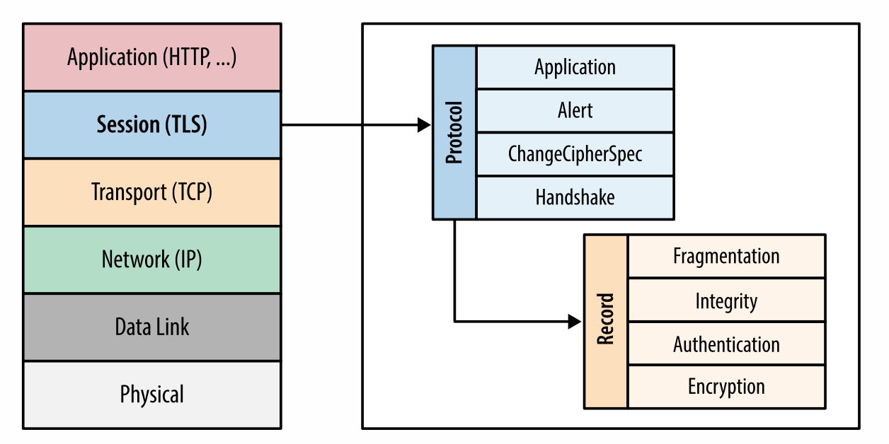
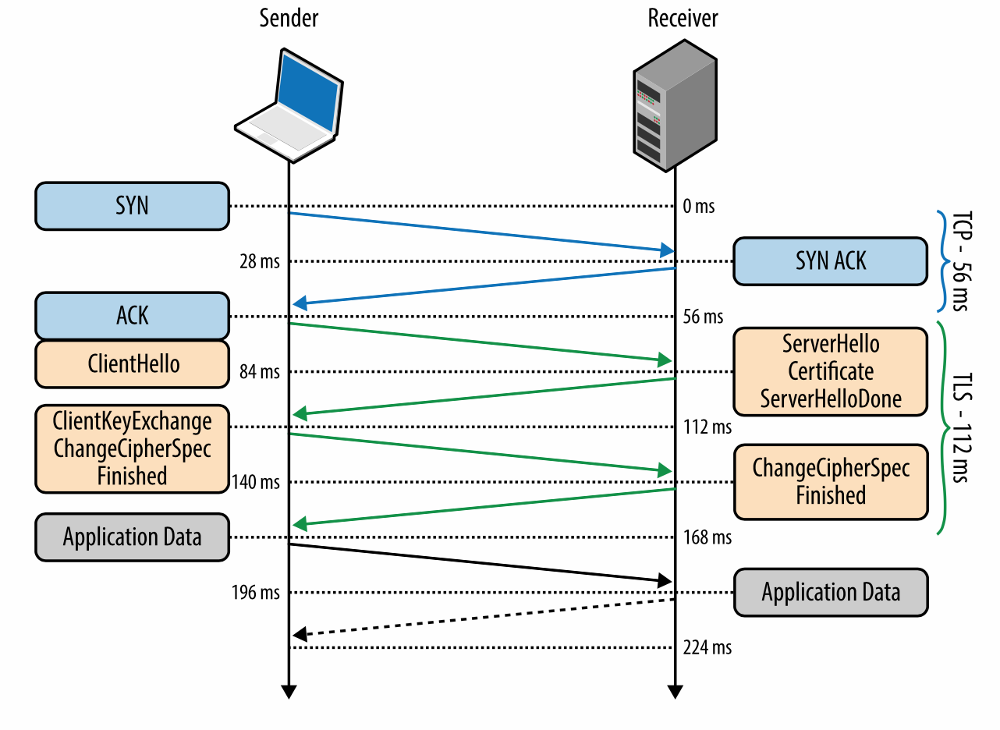
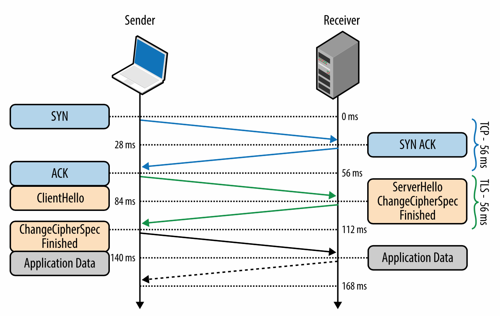
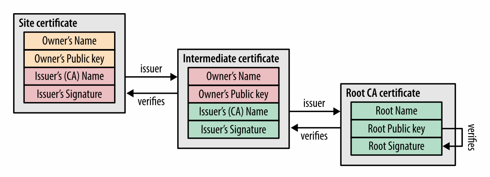
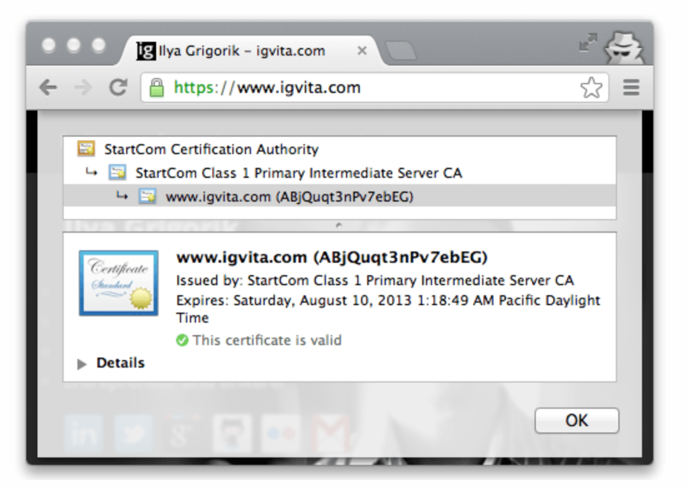
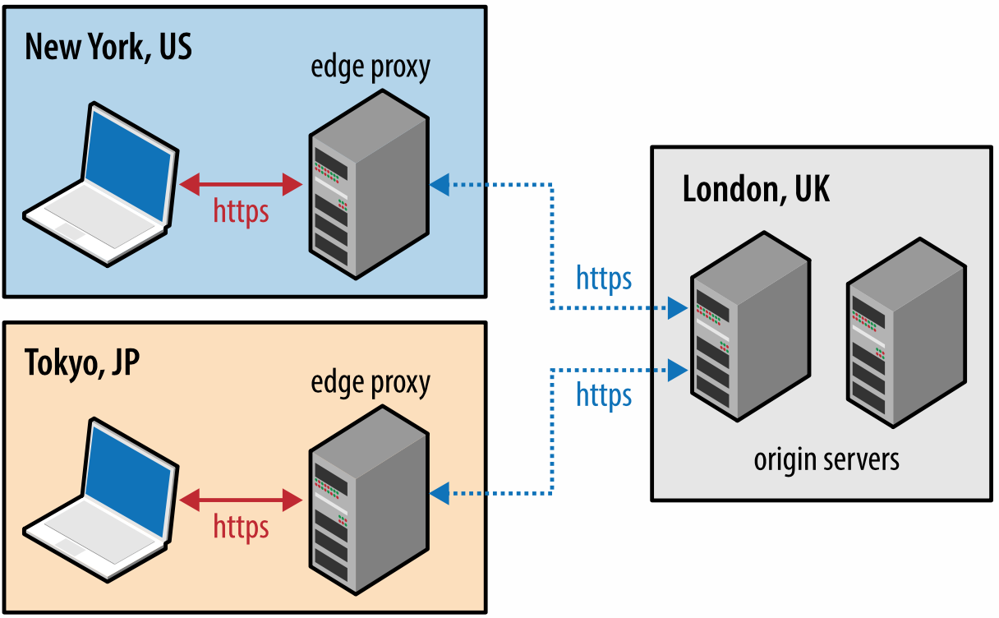
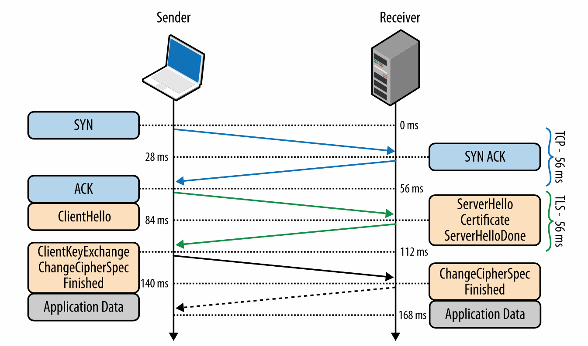

# 安全传输层协议

SSL 协议是最初是由网景公司开发用来确保网络中电子商务数据交易的安全，这需要对用户数据进行加密，身份验证以及保证数据完整性等等。为了实现这一点，SSL 协议在应用层实现，构建在 TCP 之上， 如图 4-1 所示，使得在它上面的协议（HTTP，电子邮件，即时通讯，和许多其他应用）在网络操通信时操作不变，同时保证跨网络交流时的安全。

图 4-1 安全传输层协议 (TLS)

如果正确使用 SSL 协议，第三方观察者只能推断出连接的双方，加密类型，数据发送的频率和大致的数据量，无法读取或者修改任何的实际数据。

**note**
> 当 IETE 将 SSL 协议标准化的时候，被重命名为安全传输层协议(TLS)。TLS 和 SSL 可以交换使用，但是技术上说，它们是不一样的，描述了协议的不同版本。

 SSL 2.0 是该协议第一个公开发布的版本，然而因为发现了大量安全漏洞，它很快被 SSL 3.0 替代。由于 SSL 协议是网景的专利，IETF 标准化协议时，1999 年一月发布的 RFC 2246 中更名为 TLS 1.0。从那时起，IETF 不断迭代该协议，解决了很多安全漏洞，同时也扩展了它的功能。TLS 1.1(RFC 2246) 在 2006 年 4 月发布，TLS 1.2(RFC 5246) 在 2008 年 8 月发布，现在是 TLS 1.3。

这就是说，不要让大量的版本误导了你，你的服务器应该始终使用最新版本的 TLS 协议来确保安全性，功能以及性能。实际上，一些对性能有重要影响的特性，诸如 HTTP/2，明确要求使用 TLS 1.2 或以上版本，否则将断开连接。

**note**
> TLS 设计使用在像 TCP 这样的可靠传输协议之上。然而它现在也可以运行在数据报协议上，如 UDP。RFC 6347 定义了安全数据包传输协议(DTLS)，它基于 TLS 协议，能够提供TLS类似的安全保证同时保留数据报的传输模式。

# 加密，身份验证和数据完整性
TLS 协议设计用来为应用提供三个基本服务加密，身份验证和数据完整性。技术上来讲，并不总是需要这三个服务。你可能在没有验证身份的情况下接受一个证书，但是你应该意识到这样做带来的安全风险。实际上，一个安全的网络应用需要所有的这三个服务。

*加密* 用来混淆从一个主机发送到另一个主机的数据

*身份验证* 判断是否提供了有效的验证材料

*完整性* 检测数据是否有篡改或者伪造

为了建立一个加密的安全数据通道，连接的双方必须在后续使用的加密算法以及加密数据的密钥上达成一致。TLS 协议制定了定义明确的握手序列来完成进行这些数据交换，我们将在之后的 [TLS 握手](https://hpbn.co/transport-layer-security-tls/#tls-handshake) 中讨论它的细节。TLS 在实际中运转良好的一个原因是它使用了公钥加密算法（又被称作对称密钥算法）的巧妙的握手过程，它使得连接双方可以在彼此没有了解的情况下通过一个非加密的信道完成私钥分享。

作为 TLS 握手的一部分，这个协议允许双方检验身份。在浏览器中使用的时候，校验机制允许客户端验证服务器是不是它宣称的身份（例如你的银行）而伪装的名称或者 IP 地址。这个验证过程基于建立好的信任链，查看[信任链与证书颁发机构](https://hpbn.co/transport-layer-security-tls/#chain-of-trust-and-certificate-authorities)。另外，服务器也可以选择验证客户端的身份，例如公司代理服务器可以校验所有的雇员，每一个雇员都应该有公司签发的唯一证书。

最终，在有了加密和身份认证后，TLS 协议还提供了消息分片机制，为每一个信息加上了信息认证码（MAC）。MAC 算法是一种单向加密哈希函数，它的密钥由连接的两端协商完成。无论一个何时一个 TLS 记录发送的时候都会生成一个 MAC 值并附加在信息中，接收方可以通过计算并验证 MAC 的值来确保信息的完整性和真实性。

这三个机制组合起来成为了网络中安全交流的基础。所有的现代网络浏览器均提供了一系列的加密套件，可以用来验证连接双方，透明地对每一条记录进行完整性检查。

>**代理，中间人，TLS 与网络中的新协议**
>HTTP 广泛的成功创造了一个活跃的生态环境，包括网络中的各种代理与中间人，如缓存服务器，安全防火墙，网络加速器，内容过滤等等。在一些情况下，我们能感受到它们的存在（显式的带来），还有一些服务对于终端用户是完全透明的。
>
>不幸的是，它们的存在也为一些试图通过 HTTP/1.x 协议传输数据的应用带来了一些麻烦。一些代理服务器在仅仅转发 HTTP 它们不能解析的扩展，一些代理服务器盲目地处理了不应该处理的数据。另外，一些安全服务器会恶意地推断正常数据。
>
>换句话说，在实践中，偏离在 80 端口定义良好语义的 HTTP/1.x 经常造成不可靠部署：一些客户端没有问题，另一些却遇到了没有定义且难以重现的行为，诸如相同的客户在变换了网络环境中看到了不一样的行为。
>
>因为这些行为，新的协议和 HTTP 扩展，例如 WebSocket，HTTP/2 等需要通过 HTTPS 信道来避免中间代理来提供一个可靠的部署模式：加密的信道混淆了所有中介媒介的数据。这就是为什么大多数的 WebSocket 指南都会告诉你要使用 HTTPS 来传输数据给移动客户端。

# 任何地方都要使用 HTTPS
通过 HTTP 或者 其他协议建立的非加密通信造成了大量的隐私，安全和完整性易受侵犯的问题。数据交换容易收到窃听，修改和模仿，这会暴露用户的整数，历史，身份和其他敏感信息。我们的应用需要要保护自己和用户，通过 HTTPS 传输数据来避免这些威胁。

*HTTPS 保护网站的完整性* 加密阻止了侵入者修改数据，例如修改内容，加入不想要的或者恶意内容等等。

*HTTPS 保护用户的隐私和安全* 加密阻止了侵入者监听数据。每一个不受保护的会暴露一些关于用户的敏感信息，并且当这样的数据包含了多个会话的信息时，可以被用来发现匿名用户的身份还可以暴露其他敏感信息。只要用户会担心的浏览活动，都应该考虑隐私和敏感信息。

*HTTPS 提供了网络中强大的特性* 诸如获取用户地理位置，照相，录像等等一系列新的网络平台特性提高了离线应用的体验，这需要用户显式的开启它们，也需要 HTTPS。HTTPS 提供的安全和完整性是传递用户许可的关键组成部分。

国际互联网工程任务组(IETF)和国际互联网架构委员会(IAB)为开发者和协议制定中提供了指南来鼓励使用 HTTPS：

1. IETF: [大量的监视是一种攻击](https://tools.ietf.org/html/rfc7258)
2. IAB: [互联网保密声明](https://www.iab.org/2014/11/14/iab-statement-on-internet-confidentiality/)

随着我们对互联网依赖的增加，每一个人面临的风险越来越大。应用的开发者和用户都有责任通过使用 HTTPS 来保护我们自己。

**note**
> 美国政府管理预算局发布的 [只使用 HTTPS 标准](https://https.cio.gov/) 是一个不错的 HTTPS 额外信息和一个部署 HTTPS 的实际的例子。

> **Let’s Encrypt **
> 
> 对于部署 HTTPS 一个常见的阻碍是需要从受信任的权威机构购买证书，[信任链与证书颁发机构](https://hpbn.co/transport-layer-security-tls/#chain-of-trust-and-certificate-authorities)。 2015 年发起的[Let’s Encrypt ](https://letsencrypt.org/)项目旨在解决这一特定问题
>
> “ Let’s Encrypt 是由互联网安全研究小组提供的免费，自动的开放证书管理机构。Let’s Encrypt 和 ACME 协议是的搭建 HTTPS 服务器和自动获取浏览器信任的证书成为了可能呢。
>
>访问项目主页，了解一下如何在你自己的站点中使用它。没有限制，每一个人都可以为它们的站点获取一个免费的授信证书。

# TLS 握手
在客户端和服务器通过 TLS 交换数据之前需要协商加密通道：客户端课服务器必须在 TLS 协议版本，加密套件和上达成一致，如果需要的话还需进行证书验证。不幸的是，这些过程都需要在客户端与服务器之间传递额外的数据包，如图 4-2 所示，这增加了 TLS 连接的延迟。

图 4-2 TLS 握手协议

*note*
> 图 4-2 和之前建立 TCP 连接的例子中有相同的假设，即纽约和伦敦之间有 28 ms 的单向延迟，详细信息查看 表 1-1。

*0 ms* TLS 运行在可靠传输(TCP)之上，意味着我们必须要先完成 TCP 三次握手，这占用了一个来回。

*56 ms* TCP 连接建立后，客户端以纯文本的方式发送一些规范，如 TLS 协议版本，支持的加密套件的列表，和其他试图使用的 TLS 选项。

*84 ms* 服务器为以后的通讯选择了 TLS 协议版本，从客户端提供的加密套件列表中选择一个，附加上它的证书，将相应送给客户端。另外，服务器还可以发送一个请求客户端的证书和其它 TLS 扩展参数。

*112 ms* 假设双发在版本和加密算法上达成了一致，并且客户端承认服务器提供的证书，客户端开始交换 RSA 或者迪菲-赫尔曼密钥用于建立加密会话的对称密钥。

*140 ms* 服务器处理客户端发过来的密钥，通过 MAC 校验信息完整性，返回个客户端加密过的 **Finished**

*168 ms* 客户端用完成协商的对称密钥解码信息，验证 MAC，如果一切正常，那么信道建立完成，应用数据可以开始传递。

在上述解释中，一个新的 TLS 连接的建立中一个完整的握手需要两个来回，这是一个坏消息。然而实际情况中，我们可以做到更好，只需要一个来回。

1. False Start 是 TLS 协议的扩展，它允许客户端和服务器在只完成一部分握手的情况下创术加密过的数据。例如，一旦 **ChangeCipherSpec** 和 **Finished** 信息送达，但是不需要另一方做同样的事情。这个优化将新的 TLS 连接开销降低到 1 个来回，查看 [开启 TLS False Start](https://hpbn.co/transport-layer-security-tls/#enable-tls-false-start)
2. 如果你已客户端之前和服务器有过通信，可以使用“简化握手”，这需要一个往返，并且通过重用之前为安全会话达成一致的参数降低了客户端和服务器的 CPU 消耗，查看[TLS 会话恢复](https://hpbn.co/transport-layer-security-tls/#tls-session-resumption)

**note**
> [TLS 1.3](https://tools.ietf.org/html/draft-ietf-tls-tls13-20) 的设计目标之一就是降低建立安全连接的额外延迟： 新连接需要 1-RTT，恢复会话 0-RTT

## RSA，迪菲-赫尔曼和前向保密
由于历史和商业原因，RSA 握手在 TSL 部署的密钥交换机制中占据了主要地位：客户端生成了一个对称密钥，用它加密服务器的公钥并把它发送给服务器作为建立会话的对称密钥。反过来，服务器使用它的私钥解密发送过来的公钥，完成密钥交换。从这一点开始，服务器和客户端在对称密钥上达成一致，并且用来加密会话。

RSA 握手运转良好，但是它有一个重要的缺点：用于认证服务器和解密发送给服务器的对称密钥所有的公-私密钥是一样的。这导致了如果有一个攻击者获取了服务器的私钥，并且坚挺了数据交换，他们可以解密整个会话。更糟糕的是，攻击者可以暂时记录下整个加密会话，一旦他获取到私钥便可以解密这些数据。

相反，迪菲-赫尔曼密钥交换允许客户端和服务器不在握手中显式的交流私钥来完成协商：服务器的私钥只用了加密和验证握手，但是建立好的对称私钥永远不会离开客户端或者服务器端，这就永远不会被一个被动的攻击者拦截到私钥。

**note**
> 维基百科的文章[迪菲-赫尔曼密钥交换](https://en.wikipedia.org/wiki/Diffie–Hellman_key_exchange)可以用来学习算法和它的性质。

迪菲-赫尔曼密钥交换可以用来降低过去交流的风险，我们在每一次密钥的时候可以生产一个新的短暂的密钥并且丢弃之前的密钥。因为我们不会交换临时密钥，并且只会在新的会话中使用，即使在最坏的情况下，攻击者侵入客户端或者服务器端并且取得会话密钥也只能破解当前或者之后的会话，对于攻击者解密之前的会话没有任何帮助。

将迪菲-赫尔曼密钥交换和临时会话密钥结合起来构成了“完美前向保密”（PFS）,获取长期密钥（例如服务器私钥）不能破解之前会话的私钥并且不允许攻击者破解之前的会话记录。一个很令人满意的性质。

一个不出所料的结果是，RSA 握手现在应该退出了，所有的主流浏览器都更喜欢支持前向保密的加密算法(例如迪菲-赫尔曼密钥交换)，另外，一些特定协议的优化只有在前向保密的情况下才可以使用，例如 1-RTT 握手的 TLS False Start。

> **公钥加密和对称加密的性能对比**
> 公钥加密只能用着 TLS 通道的建立阶段，认证证书，执行密钥交换。
>
> 用来建立对称密钥的对称密钥算法在会话中的所有交流中都会使用。为了提升性能的话，对称密钥的计算量更大。为了对比差异，如果你的电脑安装了 OpenSSL 的话，你可以运行下面的测试：
> 1. $> openssl speed ecdh
> 2. $> openssl speed aes
>
> 需要注意，两个测试的单位不是可以直接比较的，Elliptic Curve Diffie-Hellman (ECDH) 测试提供了每种不同密钥大小所需时间的汇总表，而 AES 的结果通过每秒处理的比特数来衡量。无论如何，ECDH 操作明显更加耗时。
>
> 具体的性能数据取决于硬件，核心数量，TLS 版本，服务器配置和其他因素。不要迷信老旧的性能数据！在你机子的硬件上运行测试，在[降低计算花费](https://hpbn.co/transport-layer-security-tls/#reduce-computational-costs)中获取更多的信息。

## 应用层协议协商(ALPN)
网络的两端可能使用自定义的应用协议交流数据。一种解决方案是在确定协议的前期分配一个众所周知的端口（例如，80 端口用于 HTTP，443 端口用于 TLS），并配置所有客户端和服务器使用它。 然而在实践中，这是一个很慢甚至不切实际的过程：每一个短裤的使用必须经过同意，更糟糕的是防火墙或者其他中间节点只允许通过 80 和 443 端口的流量。

为了便于部署自定义协议，我们必须重用 80 或者 443 端口，并且使用一个额外的机制来协商应用层协议。80 端口为 HTTP 协议保留，HTTP 规范提供了一个特殊的 *Upgrade* 流来实现这个目的。然而使用 *Upgrade* 会造成额外的延迟，查看 l[代理，中间服务器，TLS 和 网络中的新协议](https://hpbn.co/transport-layer-security-tls/#proxies-intermediaries-tls-and-new-protocols-on-the-web)

> **note**
> HTTP Upgrade 流的例子可以查看[升级到 http2](https://hpbn.co/http2/#upgrading-to-http2)

你可能已经猜到了解决方案，那就是使用为 HTTPS 保留的 443 端口。端到端加密信道混淆了中间代理的数据，开启了一个快速而可靠的建立新应用层的协议的方式。然而，我们仍需要一个机制来协商如何在 TLS 会话中使用新协议。

应用层协议协商(ALPN)，正如它名字暗示的那样，是一个用来解决应用层协议协商问题的 TLS 扩展。它扩展了 TLS 握手(图 4-2), 运行两端协商协议而不用额外的往返。具体的流程如下：
1. 客户端在 *ClientHello* 中添加一个新的名为 *ProtocolNameList* 的字段，包含了一些列支持的应用层协议。
2. 服务器检查 *ProtocolNameList* 字段，并在 *ServerHello* 信息中添加 *ProtocolName* 字段用于说明选择了哪个协议。

服务器可能只响应一种协议，如果它不支持客户端列表中的任何一种协议，可能会选择断开连接。结论是，一旦 TLS 握手完成，两端的安全新的已经建立，客户端和服务器均同意使用某种应用层协议，客户端和服务器可以理解通过达成一致的协议进行通信。

> **NPN 和 ALPN 的历史和关系**
> 谷歌开发的下一代协议协商 (NPN) 是一个 TLS 扩展，包含在 SPDY 中，实现了在 TLS 过程中完成高效的应用协议协商。听起来很像？它在功能上和 ALPN 等价。
>
> ALPN 是 IETF 审核并认可的 NPN 扩展版本。在 NPN 中，服务器对支持的协议提供建议，客户端选择并确认协议。在 ALPN 中这个过程反了过来，客户端声明支持哪些协议，服务器选择并确认。这样做的基本原理是让 ALPN 和其他协商协议标准更接近一些。
>
> 换句话说，ALPN 是 NPN 的继任者。

## 服务器名称指示(SNI)
任意 TCP 的两端均可建立一个加密的 TLS 信道，客户端只需要知道另一端的地址，并且进行 TLS 握手即可。然而，如果服务器拥有多个独立的主机该如何运行？每一个主机有自己的 TLS 证书但使用同一个 IP 地址。有陷阱的问题，答案是无法运行。

为了解决这个问题，TLS 协议引入了服务器名称指示(SNI)扩展，它允许客户端在 TLS 握手中指定主机名。反过来，服务器可以检查 *ClientHello* 中的 SNI 主机名，选择合适的主机，完成 TLS 握手。

> **TLS, HTTP 和 专用 IP**
> TLS + SNI 工作流通过 HTTP *HOST* 头来区分，用户在请求时会在这里设定主机名，相同的 IP 地址可能有不同的域名，SNI 和 *HOST* 都要求消除它们的歧义。
> 不幸的是，在一些过时的客户端(如 运行在 XP 上的 大多数版本 IE，Android 2.2 等等) 不支持 SNI。结论是如果你需要在这一的客户端中提供 TLS 的话，你可能需要给每一个主机一个独立的 IP。

# TLS 会话恢复
完整的 TLS 握手造成的额外延迟和计算消耗对于所有需要安全交流的应用都是严重的性能损失。为了帮助减少这些消耗，TLS 提供了一个机制来重用或者分享达成一致的密钥。

## 会话标识
“会话标识符”（RFC 5246）恢复机制在 SSL 2.0 中首次被引入，它允许服务器创建并发送一个 32 字节的会话标识符作为 *ServerHello* 信息的一部分，在我们之前看到的完整 TLS 协商中。有了会话 ID，客户端和服务器双方都可以存储之前达成一致的会话参数，在之后的会话中复用它们。

特别的，客户端可以把会话 ID 放在 *ClientHello* 信息中来指示它还记得之前握手中达成一致的密钥和加密算法并可以复用它们。反过来，如果服务器可以在缓存中发现之前的会话参数，那么便可以使用简化握手，如图 4-3 所示，否则需要完整版的协商并生成一个新的会话 ID。

图 4-3 简化的 TLS 握手协议

会话标识符使我们减少了一整个往返以及用于协商共享私钥的公钥加密算法开销。复用之前达成一致的会话数据使得建立一个安全连接在不损失安全性的情况下变得更快。

**note**
> 会话复用对于部署 HTTP/1.x 和 HTTP/2 都是一个重要优化。简化握手缩短了一整个往返的延迟，显著降低了连接双方的计算开销。
> 
> 实际上，如果一个主机需要多个连接的时候(例如使用了 HTTP/1.x)，在打开一个新的连接之前需要等待第一个 TLS 协商完成，这样它们可以服用相同的会话参数。如果你之前曾经查看过网络踪迹，这就是为什么你很少看到过相同主机的多次 TLS 协商。

然而，一个实际的限制是会话标识符机制需要服务器为每一个客户端创建并维护一个缓存。这会对每天有数万个不同连接的服务器造成一系列的问题，如TLS 连接的内存开销，会话 ID 缓存和收回机制，以及为一个流行站点部署多个服务器的问题，理想情况下，它们应该共享一个 TLS 会话缓存。

上述问题没有一个是不可解决的，如今许多高流量的站点已经成功使用了会话标识机制。但是对于多服务器的部署，会话标识符需要仔细的思考和架构来确保正确操作会话缓存。

## 会话票据
为了解决上述服务器端对 TLS 会话缓存的担忧，RFC 5077 引入了"会话票据"机制，它用来代替为每一个客户端保持一个会话状态。如果一个客户端声明它支持会话票据，服务器可以引入一个 *New Session Ticket* 记录，它包含了所有协商好的会话数据，由只有服务器知道的一个私钥加密。

客户端储存该会话票据，在接下来的会话中，将其包含在 *ClientHello* 信息的 *SessionTicket* 扩展中。因此，所有的会话数据只由客户端储存，但是该票据依旧是安全的，因为它由只有服务器知道的私钥加密。

会话标识符和会话票据机制通常被称为 *会话缓存* 和 *无状态恢复* 机制。无状态恢复主要用来取消服务器端的缓存，这降低了部署的要求并且会话票据可以在每一个到服务器的连接中使用知道票据过期。

**note**
> 实际中，在负载均衡服务器组中部署会话票据依旧需要仔细思考和架构：所有的服务器必须使用相同的会话私钥，还需要一个额外的机制来周期性更新所有服务器上共享的私钥。

# 信任链与证书颁发机构
身份认证时建立每一个 TLS 连接必不可少的一部分。毕竟我们可能通过加密通道和任何一段通讯，包括攻击者，除非我们能够确认和我们通信的是值得信赖的，否则说了的加密工作都是徒劳的。为了理解我们如何辨别另一端的身份，让我们用爱丽丝和鲍勃直接的认证流程作为一个例子:
1. 爱丽丝和鲍勃生成了他们的公钥和私钥
2. 爱丽丝和鲍勃隐藏了各自的私钥
3. 爱丽丝将公钥分享给鲍勃，鲍勃将他的私钥也分享给爱丽丝
4. 爱丽丝发送一个新的信息给鲍勃，并用私钥签名
5. 鲍勃用爱丽丝的公钥来验证信息签名

信任是上述过程的关键。特别的，当公钥加密允许我们使用发送者的公钥来验证正确私钥签名过的信息，但是接受发送者依旧是建立在信任的基础上。在刚才的例子中，爱丽丝和鲍勃当他们面对面的时候是可以交换公钥的，因为他们彼此认识，他们确认交换的对方不是一个骗子，谈他们通过之前建立的另一个秘密(物理)握手验证了对方的身份。

接下来，爱丽丝收到了她从没有遇到过的查理的一条信息，但是他说他是查理的朋友。事实上，为了证明他是鲍勃的朋友，查理请鲍勃用鲍勃的私钥为他的公钥签名，并将这个签名附在信息中如图 4-4 所示。这种情况下，爱丽丝首先检查有鲍勃签名的查理的公钥。因为他信任鲍勃信任查理的决定，她接受了这个信息并且用相同的完整性校验来保证信息是来自查理的。

图 4-4 爱丽丝，鲍勃和查理的信任链

我们刚刚做的就是建立信任链，爱丽丝信任鲍勃，鲍勃信任查理，并且信任是可以传递的，爱丽丝决定信任查理。只要在这个链条中没有人说谎，我们就可以扩展信任链。

浏览器中的网络身份认证和上述的过程完全一样。这意味着你会被询问你的浏览器要信任谁，你使用浏览器的时候信任谁？这里至少有三个答案：

*手动指定证书* 每一个浏览器和操作系统提供了一个允许你手动导入你信任的证书。你如何获取这些证书并认证其完整性完全取决于你。

*证书颁发机构* 证书颁发机构(CA)是一个值得证书所有者以及需要该证书双方都信任的第三方。

*浏览器和操作系统* 每一个浏览器和操作系统都自带了一系列的知名证书签发机构。因此，你需要信任软件提供商和它提供的信任列表。

实际中手工验证每一个网站的密钥是不现实的（尽管你十分愿意的话是可以做到的）。因此，最常见的解决方案是让证书颁发机构为我们做这件事情，如图 4-5。浏览器指定了哪一些 CA 是可以信任的（根 CA），之后 CA 负责验证每一个它签名的网站，审查这些证书有没有滥用或者修改。如果有一些网站的 CA 证书被修改了，撤销这些被修改的证书也是 CA 的责任。

图 4-5 CA 签署数字证书

每一个浏览器都允许你检查安全连接的信任链，图 4-6，通常通过点击 URL 旁边的图片查看。

图 4-6 信任 igvita.com 的证书链 (Google Chrome, v25)

1. igvita.com 由 StartCom Class 1 Primary Intermediate Server签名
2. StartCom Class 1 Primary Intermediate Server 证书由 StartCom Certification Authority机构签发
3. StartCom Certification Authority是一个被认证的根证书签发机构。

信任链中的锚点就是根证书签发机构，在上面的例子中就是是 StartCom Certification Authority。每一个浏览器会预置受信任的证书颁发机构（“根证书”）列表，在上面的例子中，浏览器信任且可以验证 StartCom 的根证书。因此，通过浏览器，浏览器供应商，StartCom 证书颁发机构的信任链，我们可以信任访问的目的站点。

> **证书透明**
> 每一个操作系统提供商和每一个浏览器都提供了一个公开的默认证书颁发机构。使用你最喜欢的搜索引擎查找并验证这个列表。实际上，大多数的系统信任数百个证书颁发机构，这是系统常见的一个问题：大量的 CA 使得浏览器的信任链可以被攻击的地方很多。
>
> 好消息是[信任透明](https://www.certificate-transparency.org/)项目致力于提供一个框架来解决这些问题，它用于监视并审查所有新发布的证书。访问项目网站来了解更多信息。

# 证书撤销
偶尔发生的问题是证书可能因为一些原因被撤销，例如私钥泄露，证书颁发机构被欺骗，或者一些良性的原因，比如更换证书，关系变化等等。为了解决这个问题，证书自身包含了一系列的说明，如图 4-7，用于检查是否被撤销。因此，为了保证信任链没有被破坏，每一端都应该用自带的说明检查证书状态。

图 4-7 igvita.com 的 CRL 和 OCSP 指令（Google Chrome，v25）

## 证书撤销列表（CRL）
证书撤销列表（CRL）由 RFC 5280 定义，规定了一个简单的机制来检查每一个证书的状态，每一个证书颁发机构维护并且周期性更新一个撤销证书序列号。每一个人都可以下载这个撤销列表，缓存下来，并且可以检查是否包含一个特定的序列号，如果包含的话，这个对应的证书就是被撤销的。

这个过程是简单直白的，但是有一些限制：
1. 随着撤销数量的增多，CRL 列表只会变长，每一个客户端都要检查整个列表的序列号
2. 没有立即通知撤销列表更新的机制，如果一个客户端在证书被撤销之前缓存了 CRL，只有当 CRL 缓存过期了之后才能更新这次撤销。
3. 获取最新的 CRL 列表时会阻碍证书验证，这显著增加了 TLS 握手的延迟。
4. 当获取 CRL 因为某种原因失败了，浏览器的行为变没有定义。大多数浏览器将这种行为称为软失败，并允许继续认证。是的，这有点令人惊讶。

## 在线证书状态协议(OCSP)
为了解决 CRL 机制的一些现在，RFC 2560 引入了在线证书状态验证协议（OCSP），它提供了实时验证证书状态的机制。不像 CRL 文件那样包含了所有被撤销协议的序列号，OCSP 允许客户端在验证证书链的时候直接查询 CA 的证书数据库。

OCSP 机制消耗的带宽更少，可以实现实时验证。然而，OCSP 实时验证也造成了一些问题：
1. CA 必须可以处理实时查询
2. CA 必须保证全球都可以在任何时候查询
3. 实时 OCSP 可能侵犯客户端的隐私，因为它知道了客户端在访问哪些网站
4. 客户端在验证证书链的时候必须停止 OCSP 请求
5. 当 OCSP 请求因为网络超时或者其他原因失败的话也会造成软失败，浏览器的行为也是未定义的

**note**
> 实际数据如 Firefox 自动测量的结果显示出 OCSP 请求大约有 15% 超时，在成功的时候增加了大约 350ms 的 TLS 握手延迟，查看[hpbn.co/ocsp-performance](https://blog.mozilla.org/security/2015/11/23/improving-revocation-ocsp-must-staple-and-short-lived-certificates/)

## OCSP Stapling
正如上述原因，CRL 或者 OSCP 撤销机制都无法同时提供的安全和性能的保证。然而不要绝望，因为 RFC 6066 证书状态请求扩展提出的 OCSP Stapling 解决了大多数我们之前遇到的问题，它通过验证服务器在 TLS 握手中，将验证信息（“stapled”）作为信息的一部分发送给客户。

1. 服务器周期性的或者并用 CA 响应的有时间戳的 OCSP 进行签名，而不是客户端发起 OCSP 请求。
2. 服务器添加 OCSP 前面（staples）作为 TLS 握手的一部分，运行客户端验证证书和 CA 签名的 OCSP 撤销记录。

这个角色反转是安全的，因为 stapled 记录是由 CA 签名的，并且可以由客户端验证，这提供了一些列的优点：
1. 客户端不会泄露访问历史
2. 客户端不会在查询 OCSP 服务器的时候阻塞
3. 客户端只会发生硬失败

为了同时获取安全和性能的保证，确保你的服务器都配置了 OCSP stapling。

# TLS 记录协议
和下层 IP 或者 TCP 层不一样的是，TLS 会话中的所有数据都使用定义良好的协议封装成帧，如图 4-8。TLS 记录协议负责区分消息的类型（握手，警告或者数据类型，通过"Content Type" 字段），同时验证每一个信息的完整性。

 

图 4-8 TLS 记录结构

典型的应用数据传递流程如下：
1. 记录协议收到应用数据
2. 将接受到的数据分块，最大 2^14 比特或者说 16 KB 每个记录
3. 将信息验证码（MAC）或者 HMAC 添加进记录
4. 用协商好的加密算法加密数据

一旦完成了这些步骤，加密过的数据便可以通过 TCP 层传递。在接收方，只需将上述过程反转即可：使用解密算法解密，验证 MAC，将数据传递给应用。

好消息是上述过程全部由 TLS 层自己完成，对于大多数的应用是完全透明的。然而，我们注意仍需一些引入记录协议造成的一些影响：
1. 最大 TLS 记录是 16 KB
2. 每一个记录包含一个 5 比特的头，一个 MAC (对于 SSLv3，TLS 1.0，TLS 1.1 大约 20 比特，对于 TLS 1.2 大约 32 比特)
3. 解密数据的时候需要整个记录

如果你有能力的话，需要为你的应用选择正确的记录大小，这回是一个重要的优化。小的记录由于成帧和 MAC 验证造成了更大的体积和 CPU 负担，大的记录需要 TCP 层重新组装才能通过 TCP 传递，跳到 [记录大小优化](https://hpbn.co/transport-layer-security-tls/#optimize-tls-record-size)获取更多的细节。

# TLS 优化
在你的应用中部署 TLS 需要一些额外的工作，无论是你的应用（例如 迁移资源到 HTTPS 避免内容混乱）还是负责通过 TLS 传递应用数据的基础设施。一个精心调教的部署可以有显著的性能提高，用户体验的提升，并且降低整体消耗。

## 降低计算开销
建立并维护一个加密信道增加了连接双方的计算开销。特别的，消耗最大的是在 TLS 握手中非对称（公钥）加密的使用（在[TLS 握手](https://hpbn.co/transport-layer-security-tls/#tls-handshake) 介绍过）。然后，一旦共享了一个私钥，便会使用对称密钥加密整个 TLS 记录。

正如我们之前提到的那样，公钥加密比对称密钥的计算昂贵的多，Web 早期的时候，常常需要额外的硬件实现 “SSL offloading”。好消息是，这不再是必要的了，曾经需要专有硬件的计算现在可以直接通过 CPU 完成。一些大组织，如 Facebook，Twitter 和 Google，都为数十亿用户提供了 TLS，在商品级硬件和软件上执行了所有必要的 TLS 协商和计算。

> 在今年一月(2010)，Gmail 迁移到全站默认使用 HTTPS。之前这被作为一个可选项引入，但是我们所有的用户都使用 HTTPS 来保证他们的邮件在浏览器和 Google 服务器之间总是安全的。为了实现这一点，我们没有部署额外的机器和特定的硬件。在我们的前端机器上，SSL/TLS 占据了大约 1% 的 CPU 负载，小于 10 KB 的内存占用和小于 2% 的网络开销。许多人认为 SSL/TLS 占用了大量的 CPU 时间，我希望前面的数据（第一次公开）可以帮助消除误解。
>
> 你只需要记住一件事情： SSL/TLS 已经不再占用太多的计算资源了。
>
> Adam Langley (Google)

> 我们希望在大范围负载均衡的软件和硬件上部署 TLS。我们发现现代基于软件实现的 TLS 运行在商品级 CPU 上已经足以应对 HTTPS 流量的高负载，不需要专业的加密硬件。我们所有的 HTTPS 流量均使用运行在商品级硬件上的软件。
>
>Doug Beaver (Facebook)

>Elliptic Curve Diffie-Hellman (ECDHE) 比 RSA 在一个安全等级的时的开销只高一点点。实践中，我们发现优先考虑使用 ECDHE 加密套件增加的 CPU 使用是可以忽略不计的。HTTP 长连接和会话重用意味着大多数的请求不需要完整的握手过程，因此握手操作不会占用太多的 CPU。我们发现 Twitter 客户端 75% 的请求使用 ECDHE 建立连接，剩下的 25% 的大多是老版本的客户端还不支持 ECDHE。
>
>Jacob Hoffman-Andrews (Twitter)

为了在你自己的部署中获得最好的结果，确保部署了[TLS 会话重用](https://hpbn.co/transport-layer-security-tls/#tls-session-resumption)，测量并优化成功率。在每一次握手中减少公钥加密操作可以显著地减少 TLS 的计算开销和延迟。没有任何理由在你不需要做的事情上花费 CPU。

**note**
谈到优化 CPU 周期数，确保你的服务器使用了最新版本的 TLS 库！不但提升了安全性，还提升了性能。

## 启用 1-RTT TLS 握手
未经优化的 TLS 会很容易造成许多额外的往返，引入了显著的延迟。例如，多-RTT 握手，慢且低效的证书撤销检查，大 TLS 记录需要多往返等等，不要让你的站点这样，你可以做的更好。

一个配置良好的 TLS 在协商 TLS 连接的时候应该只增加最多一个额外的往返，无论是新的连接还是重用的连接，并且要尽量避免其他的延迟仙剑，配置会话重用，开启前向安全并启用 TLS False Start。

**note**
> 为了获取最好的端到端性能，检测你的应用使用的第三方服务，包括你的 CDN 提供商。[istlsfastyet.com](https://istlsfastyet.com/) 提供了一个流行的服务和 CDN 的概要。

## 优化连接重用
减少建立新的 TCP+TLS 连接的延迟和 CPU 开销的最好方法是优化连接重用。这样做降连接建立的成本分散到每一个请求上并且给用户提供了一个更快的体验。

检测你的服务器和代理配置，让它们允许长连接并检查连接超时的设置。许多流行的服务器设置了较短的超时时间（例如 Apache 的一些版本默认 5s 超时）这造成了一些不必要的重新协商。最好的方法是根据你的日志，分析并决定一个最优的超时时间。

## 提前终止
正如我们在[延迟和带宽基础](https://hpbn.co/primer-on-latency-and-bandwidth/)中提到的那样，我们不能让数据包传递的更快，但是我们可以让数据包传递的更短。通过让我们的服务器离用户更近（图 4-9），我们可以显著降低往返时间和 TCP 与  TLS 握手的总开销。

图 4-9 连接的提前终止

实现这一点的一个简单方式是利用内容分发网络(CDN)，它在全球维护了一系列的服务器，或者我们自己部署。通过运行用户使用最近的服务器完成连接而不是横跨大陆和大洋的线路到你原始的服务器。由于更短的往返时间，客户端可以从“提前终止”中获得很多好处。这项技术对于静态和动态的内容都有好处，静态的内容可以被服务器缓存下来并由边缘服务器提供，然而动态请求需要建立边缘服务器到原始服务器的连接。

> **无缓存的源获取**
> 使用 CDN 或者代理服务器来获取资源的技术需要为每个用户定制或者包含其他的私有数据，因此在边缘网络是无法全局缓存这些数据的，这通常被称作 “无缓存的源获取”。
>
> 尽管在数据被分布在世界各地的服务器缓存的时候 CDN 工作的很好，但是无缓存的源获取仍旧能提供很好的提升。客户端的连接由最近的服务器完成，这显著降低了握手延迟。反过来，CDN 或者你自己的代理服务器可以维护一个 “热连接池” 将数据传递到源服务器，允许你快速给客户端响应。
>
>实际上，可以添加额外的抽象层来优化，一些 CDN 提供时会使用服务器作为两级的两端！客户端会连接临近的 CDN 节点，这个请求被转发到源服务器。CDN 网络中的一条会经过高度优化的 CDN 主干网络转发，这可以进一步的降低客户端和源服务器之间未来的延迟

## 配置会话缓存和无状态恢复
使用户连接到更近的服务器是一种可以在所有情况下降低用户延迟的优化方式，但是话说回来，没有比特比不发送的比特更快，这意味着我们要尽可能的少发数据。开启 TLS 会话缓存和无状态恢复使我们降低了一整个往返的延迟并降低了重复访问者带来的计算开销。

TLS 会话需要的的会话标识符有 SSL 2.0 引入，大多数的客户端和服务器已经支持。然而，如果你在你的服务器上配置 TLS 的话，不要默认假设所有的会话都支持。实际上，你最好知道是大多数的服务器是默认关闭的。双重确认一下你的服务器，代理和 CDN 的配置：
1. 多进程或工作节点应该共享一个会话缓存
2. 共享会话缓存的大小应根据流量调整。
3. 会话超时周期应该设定
4. 在多服务器的构建中，相同 IP 的客户端或者相同的 TLS 会话 ID 应该转发到相同的服务器，这可以提升会话缓存的利用率
5. 不同服务器应该共享缓存使得会话缓存利用率提升，需要建立一个安全机制来共享并更新密钥来解密会话票据。
6. 检测并监视你 TLS 会话的统计信息，确保性能最高

实践中，你应该配置会话缓存和会话票据机制。这些机制合在一起覆盖了新老连接。

## 启用 TLS False Start
会话重用提供了两个重要的好处：对重新访问的浏览者减少了一个额外的握手以及通过使用之前达成一致的会话参数降低了计算开销。然而，这不能帮助第一次和服务器交流的访问者，或者是之前会话过期的情景。

为了覆盖新老访问者，我们可以使用 TLS False Start，它是一个可选的协议扩展，运行发送者在握手只完成一部分的情况下发送数据，如图 4-10。

图 4-10 启用了 False Start 的 TLS 握手

