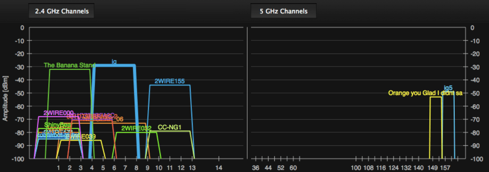

# WiFi

WiFi 使用无需授权的 ISM 波段；对于任何人在任何地方来说，部署 WiFi 都是十分简单的，它需要的硬件是十分简易的。不足为奇的是，WiFi 成为了实际上部署最广，最为流行的无线标准之一。

拥有 WiFi 商标的国际 WiFi 联盟是一个致力于建立并推广无线局域网技术的商业联盟，提供互操作性标准和测试。技术上来讲，一个设备必须经过国际 WiFi 联盟的认证才能使用 WiFi 的图标和名称，但是实际上，这个名称被用来指代任何基于 802.11 标准的设备。

 1997 年提出了第一个 802.11 协议的草案，或多或少的直接吸收了以太网标准（IEEE 802.3）进入到无线交流的世界。然而，直到在 1999 年引入了 802.11b 标准，WiFi 设备的市场才开始发展。相对简化的技术，简单的部署，便捷，在无需授权的 2.4 GHz ISM 波段使得任何人都可以方便的利用已有的局域网提供“无线扩展”。如今，大多数的新式笔记本，台式电脑，平板电脑，智能手机，等等几乎所有设备都可以使用 WiFi。

 # 从以太网到无线局域网
 802.11 无线标准最初被设计为以太网(802.3)标准的扩展。以太网通常用来指代局域网标准，802.11 系列（图 6-1）相应的被用做无线局域网标准（WLAN）。然而从技术上来讲，很多以太网协议由 ALOHA 网络协议启发，这是第一个公开展示的无线网络，由夏威夷大学在 1971 年开发。换句话说，我们转了个圈子。

 

 图 6-1 802.3 (以太网) 与 802.11 (WiFi)，数据和物理层

了解调度所有通信的机制需要我们弄清楚 ALOHA 网络以及接下来的以太网与 WiFI 协议之间的区别。换句话说，它们都需要共享介质作为“随机接触信道”，无论是有线还是无线电波，这意味着没有主进程或者调度器来控制在某一时刻谁或者哪个设备可以发送数据。相反，每一个设备自己决定是否发送数据，所有的设备在一起工作来保证共享信道的性能表现。

以太网标准历史上使用了概率载波侦听多路访问（CSMA）协议，通俗来说是在发送之前先听一下。如果你有数据要发送了：
1. 检测是否有人在传输数据
2. 如果信道繁忙，一直监听直到信道空闲
3. 当信道空闲的时候，立即发送数据

当然，任何信号的传输都需要时间，因此冲突仍然会发生。为了这个原因，以太网标准添加了冲突检测（CSMA/CD），当冲突发生的时候，双方立即停止传输数据并随机休眠一段时间（带有指数回退）。这样，多个相互竞争的发送者就不会同步发送或者同时重新发送数据。

WiFi 使用了一个类似但有一点不同的模型：由于硬件对无线电的限制，无法在发送数据的时候检测冲突。因此，WiFi 使用了冲突避免机制（CSMA/CA），每一个发送者都只在信道是空闲的时候发送整个信息帧来尝试避免冲突。一旦 WiFi 帧发出，在下一次发送数据前要等待接收方显示的应答。

有一些更多的细节,但简而言之是说: 这些技术的组合保证以太网和 WiFi 都可以正常的接触共享介质。在以太网中，媒介是物理连接，在无线的情况下，共享的是无线电信道。

实践中，在网络负载很低的情况下，随机访问模型工作的很好。我们不会在这里展示太多的数学，但是我们可以证明为了达到一个很好的信道使用率（最小化冲突数量），信道负载需要低于 10%。如果负载保持的很低，我们可以在没有显示的协调或调度的情况下达到很高的吞吐。然而，如果负载增加，冲突的数量会急剧上升，这会导致整个网络的性能不稳定。

**note**
如果你尝试过高负载的 WiFi 网络，有许多发送方在竞争访问网络，在一个大型公共场所中，例如一个会议室，你会直接感受到不稳定的 WiFi 性能表现。当然，概率调度模型不是唯一的因素，但是是一个重要的印象因素。

# WiFi 标准与特点
WiFi 802.11b 标准已经进入日常生活之中，但是和其他流行的标准一样， IEEE 802 标准委员会并没有闲下来，仍旧在不断的推出新的标准（表 6-1），它们有着更高的吞吐，更好的调制技术，多路传输和很多其他的新特性。

802.11 协议|推出时间|频率(GHz)|带宽（MHz）|每个流数据速率（Mbit/s）|最大 MIMO 流数量
----|----|----|----|-----|-----
b|1999 年 9 月|2.4|20|1, 2, 5.5, 11|1
g|2003 年 6 月|2.4|20|6, 9, 12, 18, 24, 36, 48, 54|1
n|2009 年 10 月|2.4|20|7.2, 14.4, 21.7, 28.9, 43.3, 57.8, 65, 72.2|4
n|2009 年 9 月|5   |40|15, 30, 45, 60, 90, 120, 135, 150|4
ac|2014 年    |5  |20,40,80,160|大约 866.7 |8

今天，“b” 和 “g”  标准是部署和支持最广泛的标准。都使用了无需授权的 2.4 GHz 的 ISM 波段，最多支持一个无线数据流。取决于当地法规，传输功率可能被限制到最大 200 mW。一些路由器可以调整这个值，但是很可能无法超过当地运行的最大值。

所以我们如何提升我们 WiFI 网络的性能呢？“n” 和 “ac” 标准将每个信道的带宽增加了一倍，从 20 MHz 到了 40 MHz，使用了高阶调制算法并且增加了并行多路无线电传输流-多输入和多输出（MIMO）。所有的特性结合起来，即将来临的 “ac” 无线标准在理想状况下可以达到吉比特以上的吞吐。

# WiFi 性能的衡量与优化
此时你应该有充分的理由质疑“理想的条件”。WiFi 网络的广泛使用和流行也创造了一个很严重的性能挑战：设备内外的干扰。WiFi 标准没有任何集中的调度器，这就意味着无法保证任何客户端的带宽和吞吐。

新的 WiFi 多媒体（WMM）扩展在对无线电干扰和延迟敏感的应用中（例如，音频，视频等）启用了基本的服务质量（QoS），但是很少的路由器，甚至更少的部署好的客户端可以使用它。同时，你的网络中的所有流量，已经你附近的 WiFi 网络一定会竞争共享的无线电资源。实际上，WiFi 网络易部署的特性使得它变得无处不在，但是广泛使用也创造了许多性能问题：现在实际上不难发现几十个不同并重叠的 WiFi 网络在高度密集的城市环境中。（图 6-2）

图 6-2 使用 inSSIDer 可视化了重叠的 WiFi 网络（2.4 和 5 GHz 波段）

最广泛使用的 2.4 GHz 波段提供了 3 个不相重叠的 20 MHz 的无线电信道： 1，6，11（图 6-3）。尽管它的分配在不同国家并不一致。在某些方面，你可能运行使用更高的信道（13，14），并且你可能被更有效率的限制到甚至更小的子网。然而，更有效率意味着在某一时刻你可能有超过两到三个的 WiFi 网络，一些可能重叠，并因此竞争共享的在相同频率的带宽。

图 6-3 数据丢失

802.11g 客户端和路由器的容量可以达到 54 Mbps，但是此刻你的邻居正在占用相同的 WiFi 信道并开始通过 WiFi 传输一个高清视频流，你的带宽会减少一半甚至更糟。你的接入点没有说过这样的安排，并且这是一个特性而不是 bug。

不幸的是，延迟的表现可能更糟。在客户端和 WiFi 接入点之间的延迟没有任何保证。当环境中有很多相互重叠的网络时，数据从客户端到 WiFi 接入点的延迟会达到数十甚至数百毫秒，你不应该为这个多变的数字感到惊讶。你在同每一个 WiFi 的使用者竞争使用一个共享的信道。

好消息是，如果你是一个早期使用者，有很多的好的改变可以用来显著提升 WiFi 网络的性能。新的 892.11 n 和 802.11ac 标准使用的 5 GHz 提供了更宽的频谱范围并且在大多数环境中的干扰较小。这就是说，至少在目前环境下，假设你周围没有很多像你一样的精通技术的朋友。一个可以使用 2.4GHz 和 5 GHz 的双频段路由器既可以兼容支持 2.4 GHz 的老旧客户端，也可以为支持 5 GHz 频段的客户端提供更好的性能。

> **衡量 WiFi 的第一跳延迟**
>
> 运行 ping 命令到你的无线网关是一个衡量第一跳的简单方式。作为一个例子，你的结果会和下面的数据不同，我自己家庭环境中的双频段 802.11n 路由器的性能测试有如下结果
>
频率 | 中位数(ms) | 95%(ms) | 99%(ms)
---|----|-----|----|
2.4|6.22|34.87|58.91
5|0.90|1.58|7.89

表 6-2 2.4 GHz 和 5GHz WiFi 波段的延迟差异

>
> 表 6-2 显示了 2.4 GHz 和 5GHz WiFi 波段之间显著地新脑差异。在有一些重叠的网络中，我的笔记本到我的无线路由器在 2.4 GHz 波段下 35ms 的延迟(95% 位置的数据)，这之间的距离只有 20 英尺远！

总结起来，关于 WiFi 的性能我们知道了什么？

1. WiFi 没有给用户任何带宽或延迟的保证
2. WiFI 的带宽随着环境信噪比变化而变化
3. WiFi 的传输功率被限制在 200 mW，你的区域内可能更小
4. WiFi 被限制在 2.4 Ghz 的频谱中，新的在 5 Ghz 波段
5. WiFi 接入点设计上运行信道分配重叠
6. WiFi 接入点和设备之间竞争使用相同的无线信道

没有“典型”的 WiFi 性能。实际的性能取决于使用的标准，用户的位置，使用的设备和当地的无线电环境。如果你幸运的话，你是唯一的 WiFi 用户，你可以得到一个很高的吞吐，或者附近的 WiFi 网络都关闭了，你可以达到一个很好的延迟和带宽。

## WiFi 网络中的丢包
在区域中有许多无线客户端的时候，WiFi 传输的概率调度算法会造成大量的冲突。然而，即使在这种情况下，并不会一定造成造成大量观测到的 TCP 丢包。实现所有 WiFi 协议的数据和物理层的实现都有它们自己的重传和错误纠正机制，这向更高层的网络协议栈隐藏了无线冲突。

换句话说，尽管数据通过 WiFi 传输的时候一定要考虑 TCP 数据包丢失的情况，TCP 观测到的绝对丢包率一般不会比无线网络中的高。相对于直接 TCP 数据包的丢失，你更可能看到更高的数据传输时间的变换范围，这是由底层数据链路层和物理层造成的重传和冲突造成的。

**note**
在 802.11n 之前，WiFI 协议在一个时刻最多只允许一个数据帧在传输，在下一个数据帧发送前需要收到数据链路层传输过来的 ACK. 在 802.11n 中，引入了 “帧聚合” 的新特性，这允许在收到一个 ACK 的时候发送多个 WiFi 数据帧。

# 优化 WiFi 网络
之前的有关 WiFi 特性的叙述描绘了一个过于悲观的场景。实践中，它看起来在大多数的场景中运行的 “足够好”，而且 WiFi 带来的遍历确实无可替代的。实际上，现在你很可能找到一个额外的以太网接口外设才能连接有线网而不是一个不支持 WiFi 的电脑，智能手机或者平板电脑。

考虑你的应用是不是值得针对为 WiFi 网络优化并从中获取收益。

## 利用无计量的带宽
实际上，一个 WiFi 网络通常是通过 DSL，电缆或光纤连接到广域网的有线 LAN 的扩展。对于在美国的一般用户而言，接入网的传输带宽是 8.6 Mbps，全球范围内是 3.1 Mbps，见表 1-2。换句话说，大多数的 WiFi 客户端仍然受限于可使用的 WAN 带宽而不是 WiFi 的限制。这就是说，无线电网络环境好的时候 WiFi 的性能也会很好。

然而撇开带宽的平均，这通常意味着典型的 WiFi 部署由无计量的 WAN 连接支持，换句话说一个有着恒高数据容量和更大的吞吐。虽然由于相关的成本和带宽上限，许多用户可能对他们 3G 或 4G 连接的大量下载敏感，但通常在 WiFi 上并不是那么关心。

当然，在所有情况下（例如，由3G或4G连接支持的WiFi系留设备），无计量的假设并不总是正确的，虽然实际上总是无计量的。如果可能的话，大量的下载，更新和数据流最好通过 WiFi 完成。不要害怕在这样的情况下提醒用户切换到 WiFi 上。

**note**
许多移动运营商推荐“Wi-Fi offloading”作为数据密集型应用程序的显式策略：提示用户切换到 WiFi，或者尽可能利用 WiFi 连接来执行后台同步和大量数据传输。

## 适应多变的带宽
正如我们看到的那样，WiFi 没有提供任何的带宽或延迟的保证。用户的路由可能有一些应用层的 QoS 政策，这提供了对于接入同一个无线网络中的多个用户提供了一定程度的公平。然而，WiFi 无线电接口自身对于 QoS 只有有限的支持。更糟糕的试试，在多个重叠的 WiFi 网络中没有 QoS 机制。

即使是几秒钟的变换，位置上的微小变化，邻居的 WiFi 活动变化甚至是无线电环境的变化都可能引起可用的带宽分配会有较大幅度的变化。

一个高清视频流可能需要数兆每秒的带宽，见表 6-3，大多数的 WiFi 标准在理想环境下都是足够的，在实践中你不应该惊讶，或者说应该预料到断断续续的吞吐量下降。事实上，由于可用带宽的动态性质，您不能也不应该使用过去的下载比特率推算未来的情况。因为播放过程中无线电条件发生变化，在视频开始时测试带宽速率可能会导致间歇性缓冲暂停。

格式|视频分辨率|编码方式|视频比特率（Mbit/s）
---|---|---|---
mp4|360P|H.264|	0.5
mp4|480P|H.264|	1-1.5
mp4|720P|H.264|	2-2.9
mp4|1080P|H.264| 3-4.3

表 6-3 YouTube 视频样例在 H.264 编码下的比特率

尽管我们不能预测可用带宽，我们可以或者说应该采用自适应比特率流等的基于连续测量的技术。

> **自适应比特率流**
> 尽管自适应比特率流不能应用到所有的资源类型，它仍然很适合长时间的流式数据，例如视频和音频内容。
>
> 用视频举例，资源可以被编码并以多个比特率存储，然后被分割成许多部分（例如，用于YouTube视频的 5-10 秒的块）。然后，当客户端正在流传输数据时，客户端或服务器可以监视每个段的下载速率，并动态地切换下一个段的比特率以针对不同的带宽进行调整。实际上许多视频流服务以低比特率段开始流，以便快速开始播放，然后根据可用带宽连续调整以下段的比特率。
>
> 您需要多少个不同的比特率级别？答案取决于您的应用程序！作为一个例子，Netflix 可以对超过 120 种不同版本的每个流进行编码，以适应不同的屏幕尺寸和可用带宽比特率。提供流畅的按需视频体验并不是一件小事。

